<div align="center">

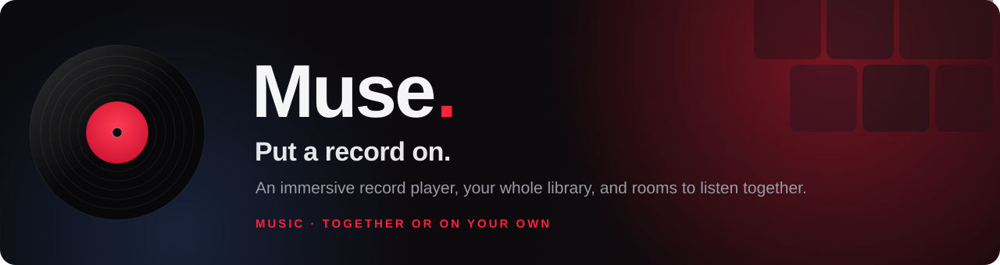

<br/>

**An immersive record player fused with real-time social listening rooms.**
Search anything, drop the needle, and hear the same second as your friends.

<br/>

[](https://muse-music-v2.vercel.app)
&nbsp;


</div>

---

## What is this?

**Muse.** is a full-stack music app built around one idea: a record you can
*touch*. A real turntable renders on screen — the vinyl spins, a tonearm rides
the groove, a beat-ring pulses around the rim, and dragging the disc scrubs the
track. Around that centerpiece sits a complete Apple-Music-style shell: search,
a library of playlists and liked songs, a taste-based **For You** page, and a
Wrapped-style **profile** that graphs what you actually listen to.

Then it goes social. **Rooms** are Discord-style spaces where everyone hears the
same song at the same second — a shared clock in the middle keeps every device
in sync. Rooms also do watch-together on YouTube, screen share, chat, and voice.

It plays real music: paste a link, search a global catalog, or upload your own
files. And because your account and everything in it live in a cloud database,
the same email and password open the **same account on every device** — laptop,
phone, anywhere.

> **Lineage.** Muse._v2 is the ground-up rebuild of **Muse._v1**. V1 established
> the identity — the vinyl, the dark stage, the record-you-can-touch feeling.
> V2 keeps that soul and gives it the things V1 never had: a real turntable you
> can scrub, synced listening rooms, a recommendation engine, taste analytics,
> and a cross-device backend.

<div align="center">
<br/>
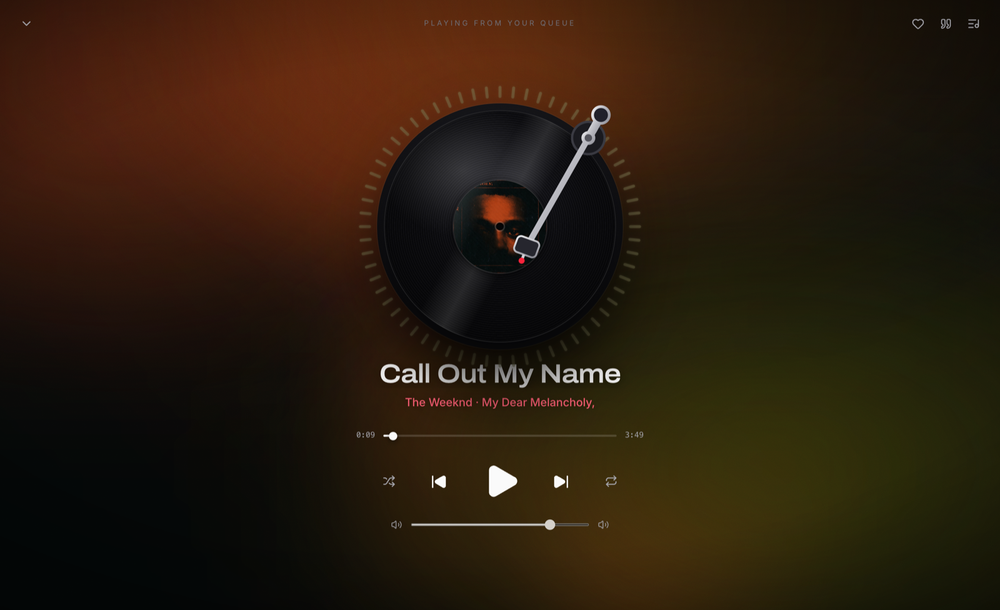
<br/>
<em>The immersive player — the cover dresses the whole page, the beat-ring rides the rim.</em>
</div>

---

## A look around

| | |
|:---:|:---:|
| 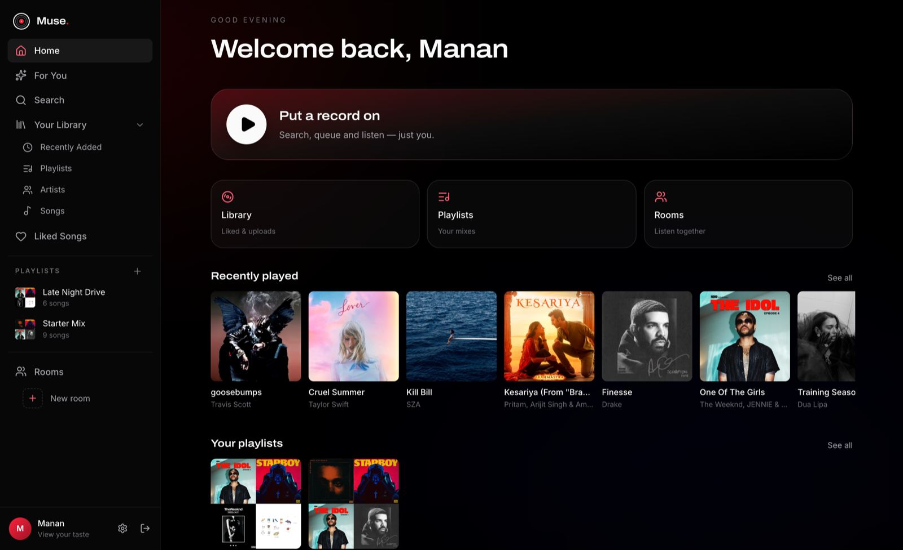<br/>**Home** — your shell, recently played, playlists | 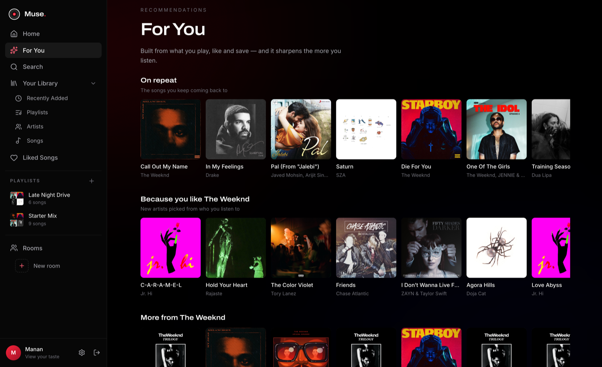<br/>**For You** — recommendations from your taste |
| 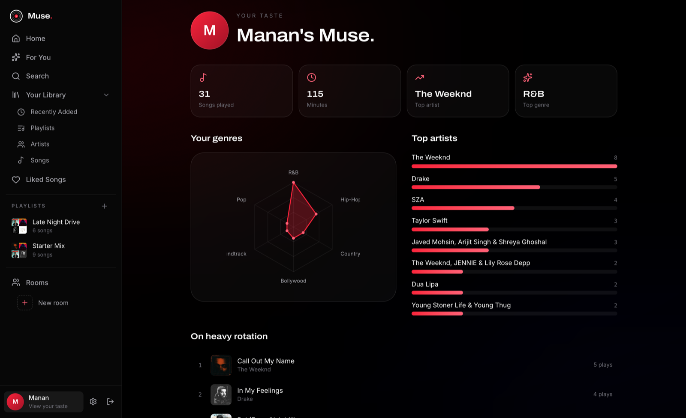<br/>**Your taste** — a Wrapped-style genre radar & top artists | 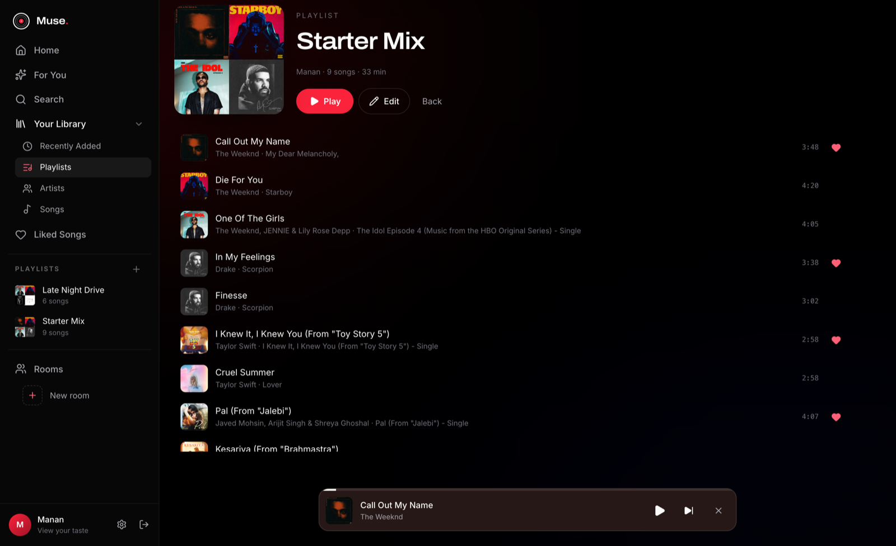<br/>**Playlists** — quilt covers, durations, edit mode |
| 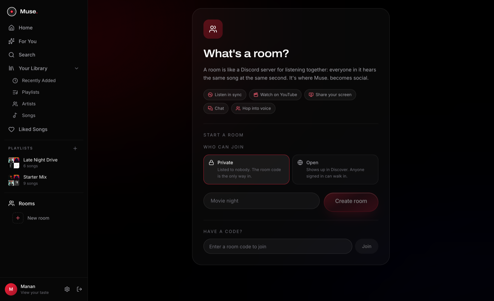<br/>**Rooms** — listen together, in sync | 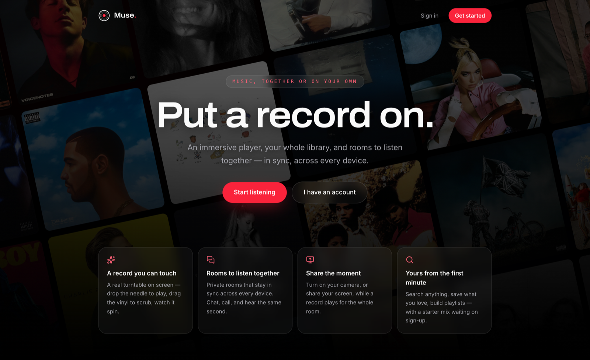<br/>**Landing** — a wall of real cover art |

---

## Features

**The player**
- A real turntable: spinning vinyl, tracking tonearm, drag-to-scrub, a canvas
  beat-ring around the disc.
- The page dresses itself in the current cover — a blurred, darkened full-bleed
  backdrop with colours sampled straight from the artwork.
- Apple-Music-style lyrics slide: the record glides left, the words rise beside
  it (time-synced via LRCLIB when available).
- Like, queue, and a now-playing bar that follows you everywhere.

**Your library & discovery**
- Search a global catalog (songs, not videos), paste links, or upload files.
- Playlists with 2×2 quilt covers, bylines, durations, and an edit mode
  (reorder, remove, rename, recover art).
- **For You** — an "On repeat" shelf, "Because you like …" discovery shelves,
  and genre shelves, all built from what you actually play, like, and save.
- Below every playlist, a Spotify-style **"recommended to add"** strip.

**Your taste (profile analytics)**
- A Wrapped/Replay-style page: total plays and minutes, top artists, most
  played, and a genre **radar chart** inferred from your real listening.

**Rooms (the social half)**
- Discord-style rooms where everyone hears the same second — a shared playback
  clock keeps devices locked together.
- Watch together on YouTube, share your screen, chat, and hop into voice.
- Anyone in the room can queue.

**Everywhere**
- One account across all your devices (cloud Postgres, JWT auth).
- Dark, signal-red theme throughout; a Synora-style onboarding that seeds your
  first mix from artists you pick.

---

## How it's built

### The shape of the system

Three parts, deployed to three places — because a static frontend, a
long-running realtime server, and a database each want different homes.

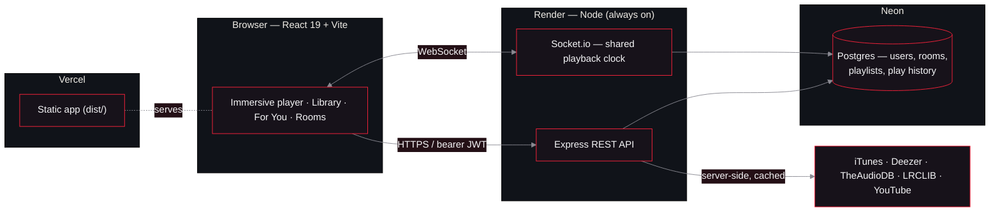

**Why split it?** Vercel is perfect for a static frontend but runs serverless
functions that spin up per request and die — a Socket.io connection needs a
socket that *stays open*, so the API + realtime server live on Render. The
database moves to **Neon** (hosted Postgres), and that single change is what
makes one account work on every device: every client reads and writes the one
cloud database. Full walkthrough in **[DEPLOY.md](DEPLOY.md)**.

### Listening together — the shared clock

A room isn't "send everyone the file." It's "agree on a timeline." One socket
event carries *what* is playing and *the moment it started*; every client does
the same arithmetic to know exactly where the needle should be.

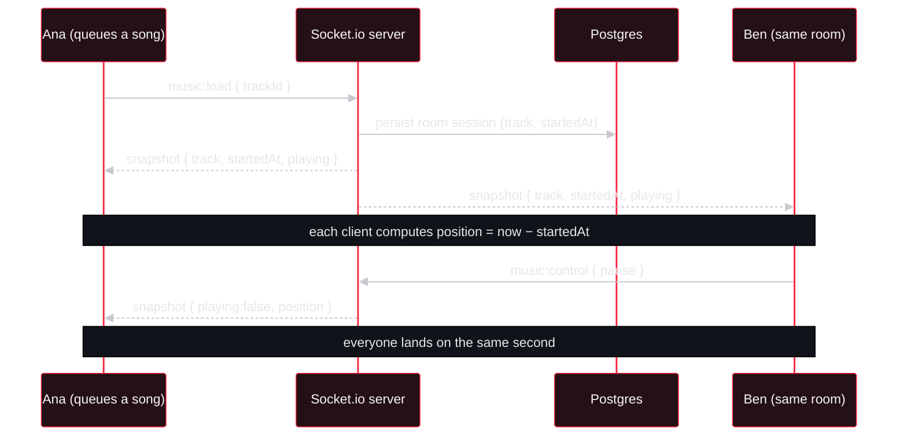

### Where the music comes from

Muse. carries no catalog of its own — it composes free, keyless data sources
server-side (and caches them), then resolves audio lazily:

| Source | Role |
|---|---|
| **iTunes Search API** | catalog metadata, cover art, primary genre |
| **Deezer** artist graph | related-artist edges that power discovery |
| **TheAudioDB** | real artist portraits |
| **LRCLIB** | time-synced & plain lyrics |
| **YouTube / Piped** | the actual audio stream |

Catalog songs travel as lightweight `cat:` reference placeholders. Nothing is
resolved to a playable stream until the moment you press play, like, or add —
one lookup per song you actually touch, which keeps search instant and the app
light.

### The recommendation engine

It's **content-based**, not collaborative filtering — there's no "people who
listened to X" crowd, only *your* signal. Every play, like, playlist add, and
onboarding pick becomes weighted evidence of taste; the Deezer graph expands
your favourite artists outward into new ones; iTunes fills in the tracks.

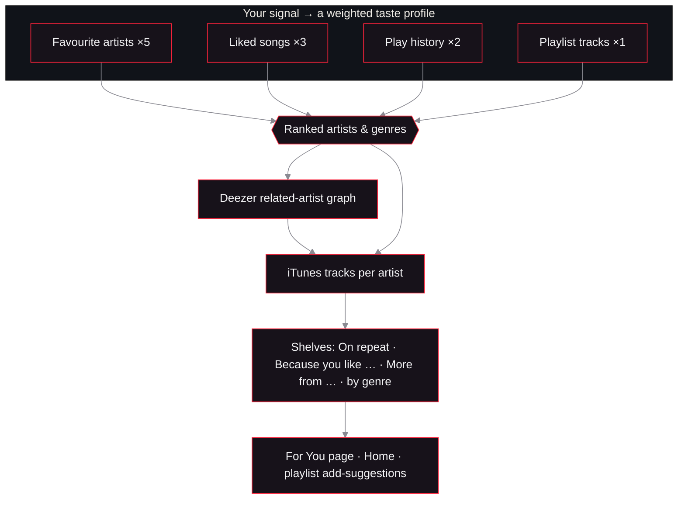

Cold-start accounts (no history yet) fall back to the charts, so the shelves are
never empty; the more you listen, the sharper they get.

---

## Tech stack

**Frontend** — React 19, Vite, TypeScript, Tailwind CSS v4 (design tokens via
`@theme`, signal red `#fa233b`), Framer Motion, Web Audio + Canvas (the
beat-ring), the YouTube IFrame API for playback.

**Backend** — Node, Express 4, Socket.io 4 (realtime sync), Prisma 6 ORM, JWT
auth (bearer token cross-origin, cookie same-origin).

**Data** — PostgreSQL (Neon in production; the Prisma schema is provider-driven).

**Hosting** — Vercel (frontend) · Render (API + Socket.io) · Neon (database).

---

## Project structure

```
muse/
├─ src/                      # React frontend
│  ├─ features/
│  │  ├─ music/              # player, turntable, browser, recommendations
│  │  │  ├─ FullPlayer.tsx   # the immersive record view
│  │  │  ├─ Vinyl.tsx        # the turntable
│  │  │  ├─ CircularVisualizer.tsx  # canvas beat-ring
│  │  │  ├─ RecShelves.tsx   # "Made for you"
│  │  │  └─ PlaylistDetail.tsx
│  │  ├─ profile/            # the "your taste" analytics page
│  │  ├─ rooms/              # create / join / discover
│  │  └─ auth/, settings/, onboarding …
│  ├─ pages/DashboardPage.tsx   # the app shell
│  └─ index.css              # Tailwind theme tokens
├─ server/                   # Express + Socket.io API
│  ├─ src/
│  │  ├─ services/
│  │  │  ├─ recommendations.service.ts
│  │  │  ├─ stats.service.ts        # taste analytics
│  │  │  ├─ sources.service.ts      # iTunes / Deezer catalog
│  │  │  ├─ artists.service.ts, charts.service.ts, lyrics.service.ts
│  │  │  └─ room.service.ts, onboarding.service.ts
│  │  ├─ sockets/            # presence + music gateways (the shared clock)
│  │  ├─ controllers/, routes/, models/
│  │  └─ server.ts
│  └─ prisma/schema.prisma   # provider = postgresql
├─ docs/                     # banner + screenshots
├─ vercel.json · render.yaml · DEPLOY.md
```

---

## Running it locally

Two processes: Vite for the frontend, and the API. One command starts both.

```bash
npm install
npm run server:install
npm --prefix server run db:push    # create tables (needs DATABASE_URL)
npm run dev:all
```

Frontend on `http://localhost:5173`, API on `http://localhost:4000`. In dev,
Vite proxies `/api`, `/socket.io`, and `/uploads` to the API, so everything is
same-origin and the session cookie works with zero configuration.

`server/.env` needs a `DATABASE_URL` (a Postgres connection string — a free
[Neon](https://neon.tech) database works, local or cloud) and a `JWT_SECRET`
(the one value the server refuses to start without). Everything else — a YouTube
API key, a TURN relay for cross-network calls — is optional and simply switches
on a feature.

---

## Deploying (and going multi-device)

The whole picture and the exact ~20-minute, zero-cost path is in
**[DEPLOY.md](DEPLOY.md)**: Neon for the database, Render for the API, Vercel for
the app, then one env var to introduce them. Multi-device needs no extra code —
moving the database to the cloud *is* the feature.

---

<div align="center">
<br/>
<sub>Built with React, Express, Socket.io, and Prisma · dark mode only, on purpose.</sub>
</div>
